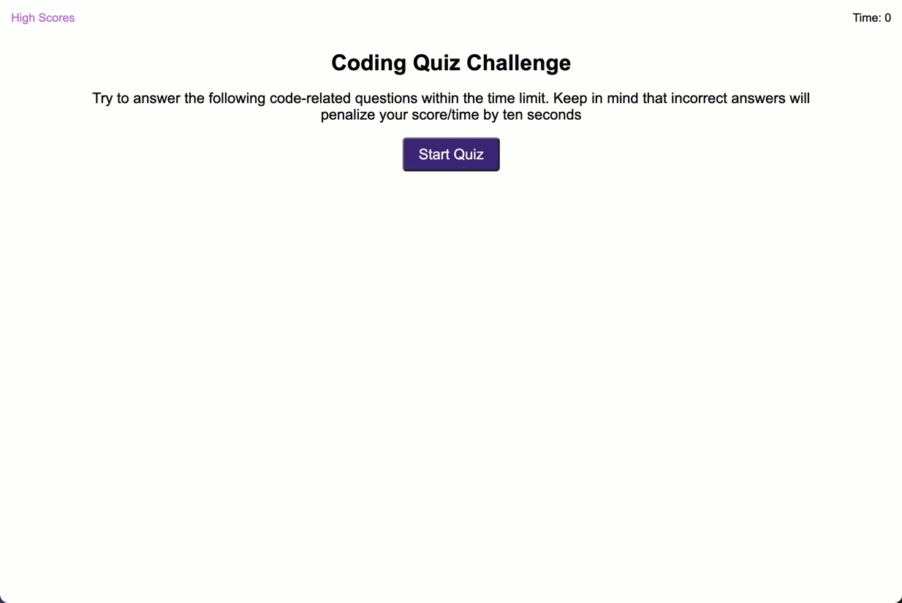

# Code Quiz

## Purpose
A timed quiz on JavaScript fundamentals that stores high scores. User can store their highscores with their initials.

## Criteria
When user selects a correct answer they move on to the next question. If user selects wrong answer then time is subracted. The game is over when time is up or all the questions have been answered.

## Built with 
* HTML
* CSS
* JavaScript
* WebAPIs

## Website

##

  

## Contribution
Made by Jason Leitz